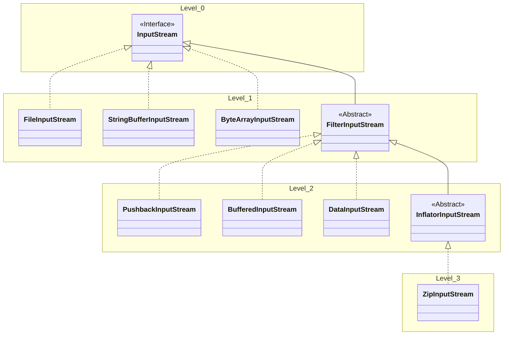

## Decorator Design Pattern

What is the Decorator Design Pattern ?

Its used to attach additional responsibilities to an object dynamically without changing the code for the object that is being decorated. It serves as an alternative to inheritance.

What's the difference between Inheritance and Docorator ?

Both Inheritance and decorator serve the puropse of enhancing the functionality of the base class or the object being decorated but they defer on how they go about achieving the same. This is what causes the difference:
<li>The enhancing of the base class happens statically at compile time in case of inheritance, while in case of Decorating, it happens dynamically at runtime.</li>
<li>In case of Inheritance, the programmer decides what feature is enhanced and how but in case of decorator the user decides how decorating happens. Both ways have their merits and demerits. In Inheritance, the chicken is pretty much cooked by the time compilation finishes, but it does ensure that its always cooked to the chef's liking whether the customer likes it or not doesn't matter but Decorator give this desicion of how the food is cooked to the customer but it assumes that the customer knows how to cook!. All this example means is that, If we know very well that the users of our product want Base class fuctinonality or one of its subclasses, its ok to use inheritace but If there is no clear indication of how a class will be used, then its better to use Decoration.</li>
<li>If we want to get the best of both worlds, i.e., We want to have the flexibiltiy to fixing functionality on the fly and don't want to end up in a situation where we are left with unusuable objects, we need to put certain restrictions on how a object is created / decorated. This can be done by using patterns like builder or factory.</li>
<li></li>

What is the problem / limitation of the decorator pattern ? and how to solve it ?

The decorator pattern lets user instantiate and decorate classes dynamically. This can easily lead to situations where the objects are
not decorated properly or not in the right order.
For example: Given a string of characters we want the following fuctionalities: 
1. Translation, 2. Encription, 3. Compression 
So, the desirable end products are like: 
1. A translated string, 
2. A translated conpressed string, 
3. An Encrypted Compressed string, 
4. An Encrypted string 
But we can also get undesirable results like:
1. A compressed translated string
2. A copressed encrypted translated string, etc.
 
How to solve ? 
Approach 1: 
Use Inheritance: like a Translator, TranslatedCompressor, TranslatedEncryptedCompressor etc,
but that would lead to 2n desirable clsses. Here we have to implement 8 classes! Imagine intorducing another feature like encoding: 24 = 16 classes! Bad idea!! 
Approach 2: 
Here we can easily introduce a Factory pattern that makes sure that translation - encryption - compression are always applied in this perticular order. 

What are the Design Principles behind it ?

<li>Open-And-Closed Principle: Classes should be open for extension but closed for modification.</li>
There are two ways to do this:

1. Decorating
2. Inheritance

What are the major components of the decorator pattern?

Decorator pattern usually have an Interface that is implemented by multiple decorators and the base objects that will be deorated.
<li>Level 0: We have an interface that is common between the docorators and the base classes that are being decorated.</li>
<li>Level 1: We have a family of base classes that will be decorated by the decorators</li>
<li>Level 2: The first level of decorators. From this level onwards, we can have a herarchy of decorators.</li>
<li>Level 3: Second level of decorators and so on ...</li>
<li>We typically need the base class then we can choose any number of decorator from any level or omit all decorator from one level all together.</li>

