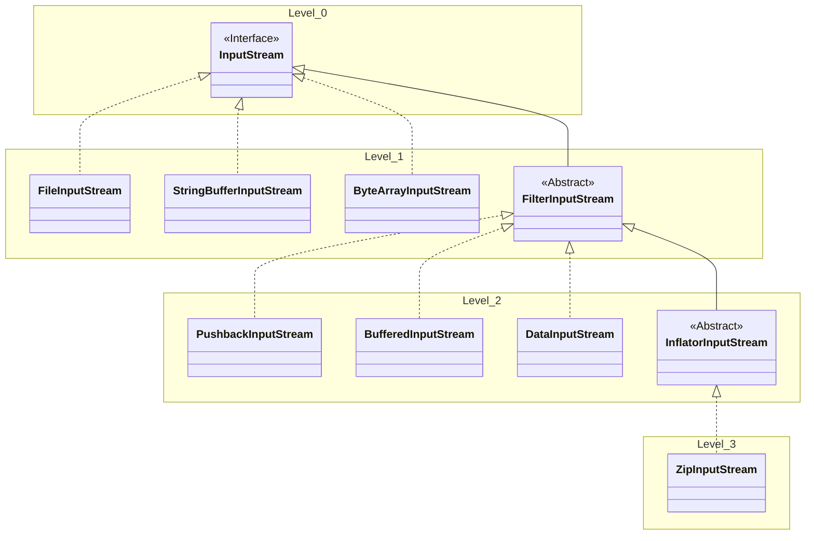

## Java IO Classes

```mermaid
classDiagram
namespace Level_0{
    class InputStream
}
    <<Interface>> InputStream
namespace Level_1{
    class FileInputStream
    class StringBufferInputStream
    class ByteArrayInputStream
    class FilterInputStream
}
    <<Abstract>> FilterInputStream
namespace Level_2{
    class PushbackInputStream
    class BufferedInputStream
    class DataInputStream
    class InflatorInputStream
}
    <<Abstract>> InflatorInputStream
namespace Level_3{
    class ZipInputStream
}
    InputStream <|.. FileInputStream
    InputStream <|.. StringBufferInputStream
    InputStream <|.. ByteArrayInputStream
    InputStream <|-- FilterInputStream

    FilterInputStream <|.. PushbackInputStream
    FilterInputStream <|.. BufferedInputStream
    FilterInputStream <|.. DataInputStream
    FilterInputStream <|-- InflatorInputStream

    InflatorInputStream <|.. ZipInputStream
```

- One thing to notice here is the heararchy of wrappers and concrete objects