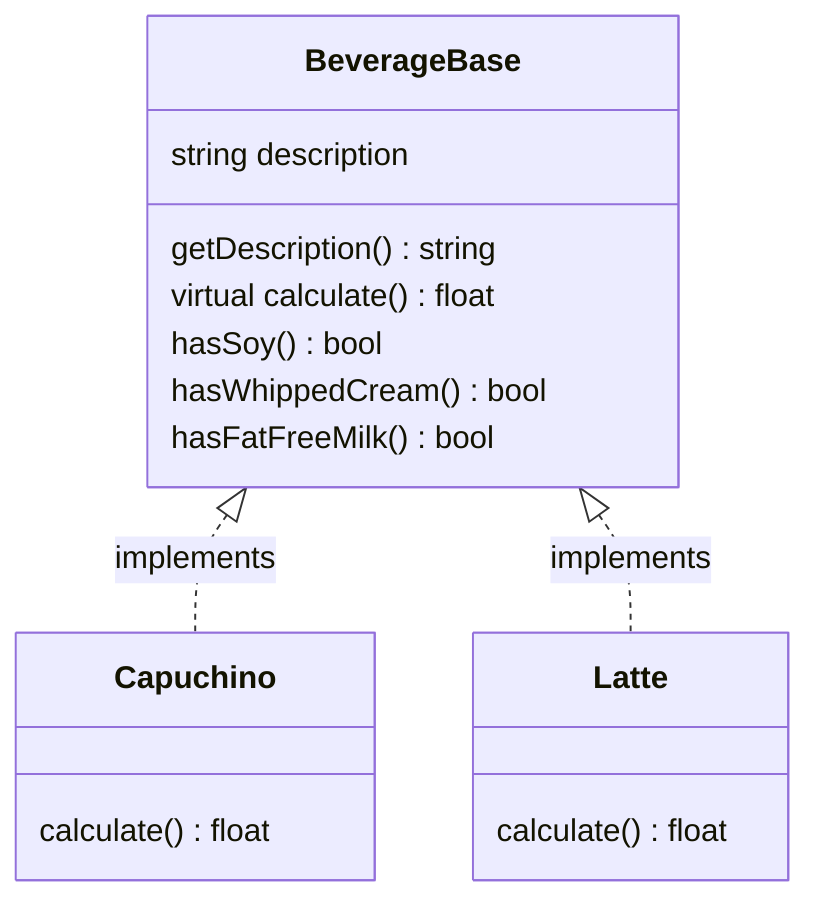
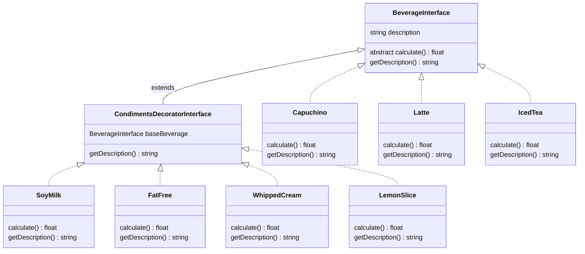

## StarBucks Problem
### Description
Let Starbucks Represent a generic cafe.
- A cafe has beverages like Tea, Espresso, Latte, Mocha, Capuchino etc.and additionally,
- they can be customized with various customizations like soy milk double shot espresso, fat free milk, etc and finally,
- there can also be topings like, whipped cream, ice cream, etc.

All the Base beverages, customizations and topings have their own decriptions and cost.

Now, We can have any combinations of these three things and still be called a beverage. Ex, Someone could order a Capuchino with soy milk and ice cream toping while another can order a Capuchino with fat-free milk and double shot espresso and whipped cream topings.

We need to be able to calculate the price of each beverage.

### Design Approach - I
Let's have a separate class for all the possible combinations of Base Beverage X Customizations X Toppings. But this will lead to exponential growth in the number of classes for each beverage, customization or topping added. So this design is not practical.

### Design Approach - II
Let's have a base class with all the customizations and toppings and let all base beverage inherit from it. We can set each customization and at the end calculate the price by checking all the cutomizations and adding the prices for it.

- But if we have a new topping or customization, We have to edit the base class and change the calculate method of all the Beverages! Clearly not a good idea.
- Changing the base class is always a bad idea!

### Design Approach - III
Since a customized beverage is still a beverage and a topped and cutomized beverage is still a beverage, let's make a base class for Beverage with the following specification:

- How to get any kind of customized beverage ?
1. Create the base beverage, say Latte.
2. Decorate with one condiment, say Soy Milk.
3. Decorate with another condiment, say Whipped cream.
Finally call calculate on the fully decorated beverage and you will get the full price.