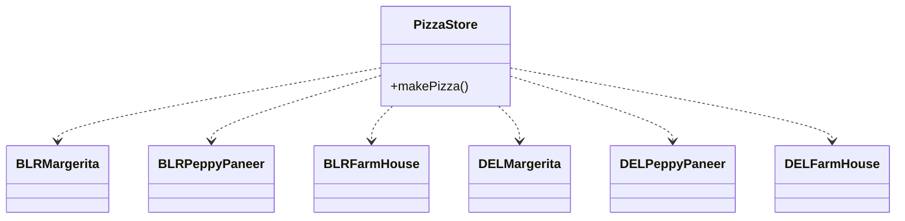
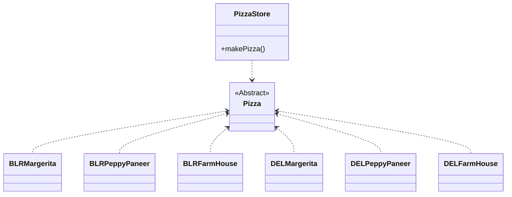

## Factory Design Patterns

What are the major patterns that come under the factory family of patterns ?

<li>SimpleFactory</li>
<li>FactoryMethod</li>
<li>Abstract Factory</li>
<li></li>

What is a SimpleFactory ?

SimpleFactory is not really a pattern, It's usually used to encapsulate away the choice logic from a bigger class to a separate class that takes the decision of what class to create and is the only class that refers to the concrete classes.

What is Factory method ?

The Factory Method Pattern defines an interface for creating an object, but lets subclasses decide which class to instantiate. Factory Method lets a class defer instantiation to subclasses.

What is an Abstract Factory ?

Privides an interface for creating a family of related or dependent objects without specifying their concrete classes.

What is the design principle behind it ?

<li>Dependeny Inversion Pirinciple.</li>
The goal here is to NOT depend on specic items rather than on generic astractions of the same.

If we Invert the dependency it becomes:

Differntiate between Simple Factory, Factory Method & Abstract Factory

<li>The FactoryMethod subclasses do look a lot like Simple Factory; however, think of Simple Factory as a one-shot deal, while with Factory Method you are creating a framework that lets the subclasses decide which implementation will be used. For example, the orderPizza() method in the Factory Method Pattern provides a general framework for creating pizzas that relies on a factory method to actually create the concrete classes that go into making a pizza. By subclassing the PizzaStore class, you decide what concrete products go into making the pizza that orderPizza() returns. Compare that with Simple Factory, which gives you a way to encapsulate object creation, but doesn’t give you the flexibility of Factory Method because there is no way to vary the products you’re creating.</li>
<li>FactoryMethod VS AbstractFactory: Both solve different problems: FactoryMethod lets users who know how to use a generic thing use specific things without new code but AbstractFactory is used to let users to know how to use a generic set of items use a specific set of the same and also to tie in a set of specific set of items are are supposed to be used together. You can think of abstract factory that is composed of a number of AbstractMethods. Infact each item that an abstractFactory returns is backed by a FactoryMethod subclass.</li>

