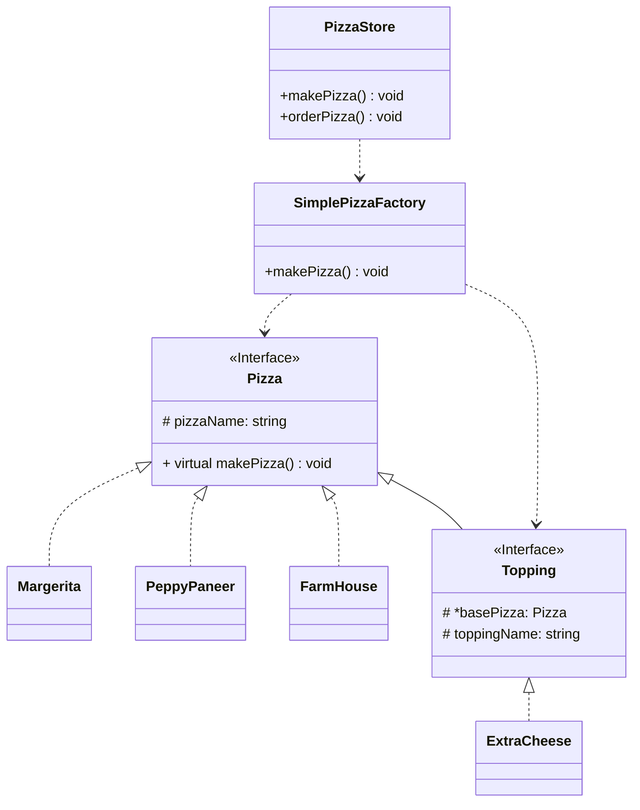
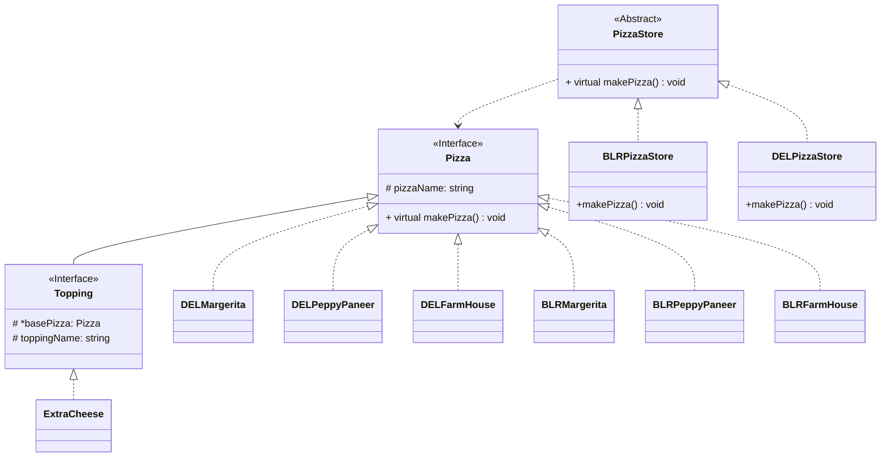
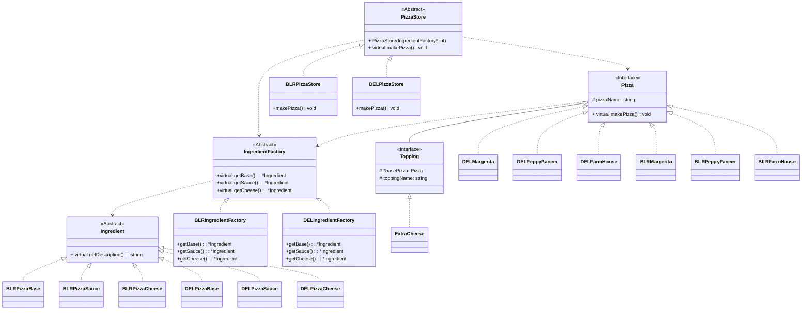

## Example problem solved using factory pattern
### Level - 1
Our client has opened a pizza store that makes pizza, cuts and boxes it.
There are 3 kinds of pizzas: Margerita, Peppy Paneer, Farmhouse
#### Objectives:
Our Client should be able to add or remove pizza easily without modifying too much.
Our Customer should be able to do a little customization like adding topings, making cheeseburst, etc.
#### Solved in: Bad.cpp, Good.cpp

#### Class Diagram

### Level - 2
PizzaStore has become very famous and has a franchise mode:
Now it has outlet in Banglore, Delhi, etc.
#### Objectives:
Same as level 1
Aditionaly, It should be easy to scale, and each franchise can have their own customizations keeping the overall procedure the same.
Ex, Banglore style pizza have a thin crust , while Delhi style have a thick crust
#### Solved in: Better.cpp

#### Class Diagram

### Level - 3
We want more quality control, We have seen while Franchises are trying to introduce new flavours they are cutting cost and not using quality ingredients. So, We will ship them whatever variations they want of their pizza ingredients but no third pary products!

#### Objectives
Same as level two.
#### Solved in Best.cpp
#### Class Diagram
