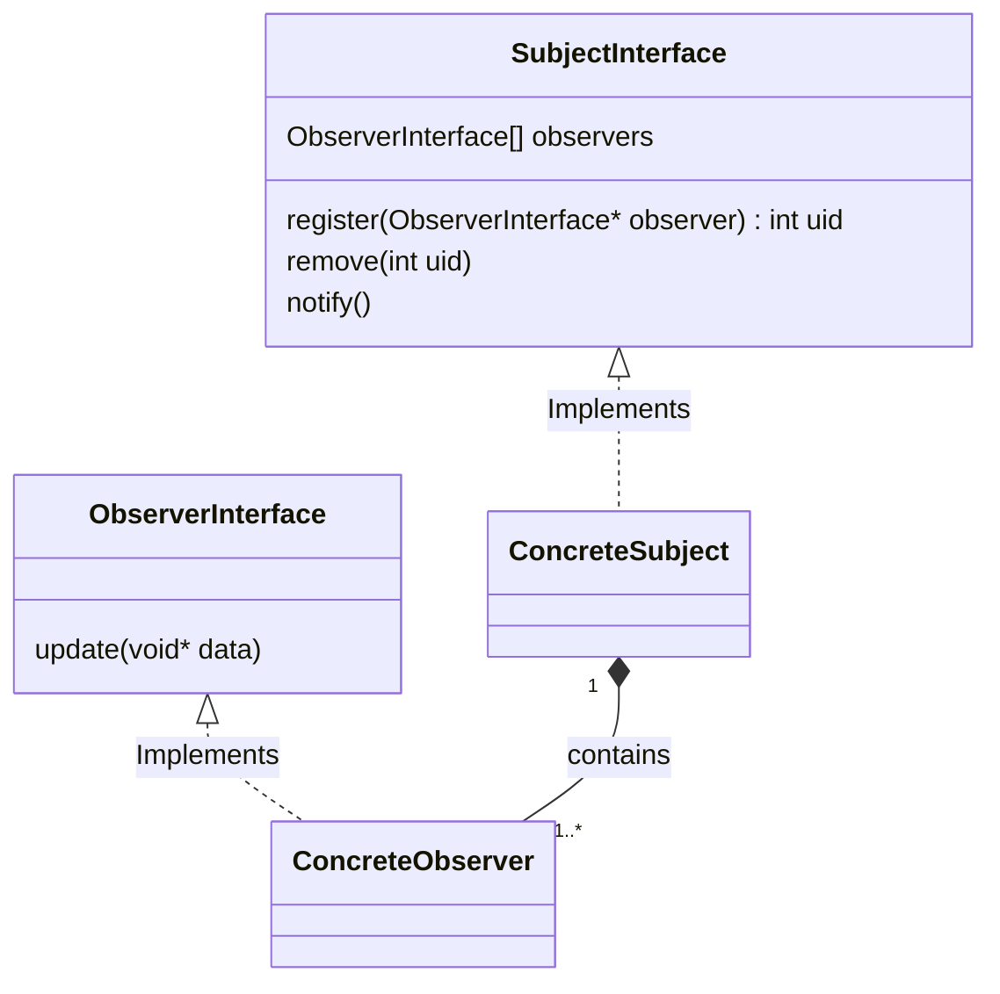

# Observer Design Pattern

What are fundamental building blocks of Observer Design Pattern?

The Observer pattern consists of two elements:  
1. <b>Subject</b>: That is the subject of observation and is the porducer of new information that is consumed by `Observer` 
2. <b>Observer</b>: The one that observes the `subject` and is subscriber to the changes in state of the subject or consumer of the information produced by the `subject`. 
The Observer model can also be called <b>Publisher - Subscriber</b> pattern.

What are basic facilities provided by the `Subject` or `Producer`?

- The `Subject` must have a way of letting `Observers` subscribe and unsubscribe for the state change or new information.

Define Observer Design Pattern

Def'n: Observer Pattern defines an one-to-many relation between objects such that the change in the state of the Subject is notified to the dependent objects automatically.

### Class Diagram

What are the underlying design principles ? Justify your answer.

The underlying design principle of the Observer pattern is loose coupling. 

How is loose coupling achieved in Observer pattern ?

<li>The only thing Subject cares and knows about the Observer is that it must implement the Observer interface</li>
<li>We can dynamically add Observers</li>
<li>Adding observers don't require change in Subject</li>
<li>We can use the Subject and Observer independently of each other</li>
<li>Changing either the subject or the Observer doesn't affect the other</li>

What is loose coupling?

Two objects A & B are said to be loosely coupled if: 
1. Both objects requires very little knowledge each to function.
2. Both objects can be changed independently of each other.
3. Both Objects can be used independently of each-other.
 
Here 'very little' is ambiguous. The feel for very little will come with experience but we can follow the following rule.
 
Start by clearly defining what Both objects need to know about each other to function. Then remove anything unnecessary.
 
Define clear interfaces that both objects must implement for their interaction.

