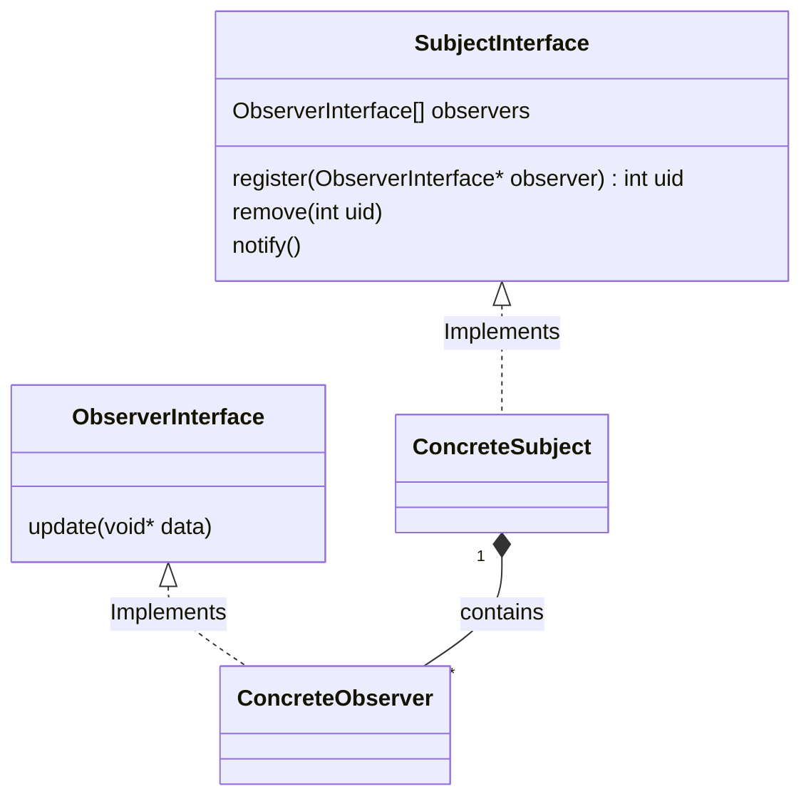

# Observer Design Pattern

What are fundamental building blocks of Observer Design Pattern?

The Observer pattern consists of two elements:  
1. <b>Subject</b>: That is the subject of observation and is the porducer of new information that is consumed by `Observer` 
2. <b>Observer</b>: The one that observes the `subject` and is subscriber to the changes in state of the subject or consumer of the information produced by the `subject`. 
The Observer model can also be called <b>Publisher - Subscriber</b> pattern.

What are basic facilities provided by the `Subject` or `Producer`?

- The `Subject` must have a way of letting `Observers` subscribe and unsubscribe for the state change or new information.

Define Observer Design Pattern

Def'n: Observer Pattern defines an one-to-many relation between objects such that the change in the state of the Subject is notified to the dependent objects automatically.

### Class Diagram
